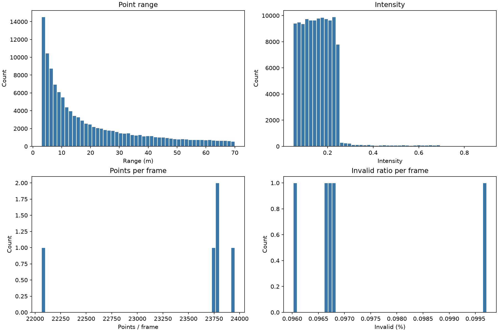
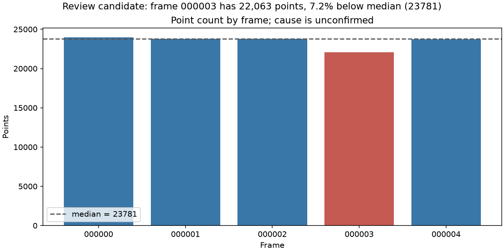

# Báo cáo Day 6: Data health dashboard

- **Họ tên:** Nguyễn Thanh Bình
- **MSSV:** 2A202602777
- **Lớp:** Track04
- **Link repo:** https://github.com/ThanhBinh159/day06-2A202602777.git
- **Topic:** E — Dashboard sức khoẻ dữ liệu
- **Dataset:** `data/synthetic`
- **Các frame đã dùng:** `000000`–`000004`

## 1. Claim

Trong 5 frame synthetic, frame `000003` có số điểm thấp hơn median 7.2% (22,063 so với 23,781), trong khi invalid ratio vẫn xấp xỉ 0.10%; dashboard đánh dấu đây là frame cần xem lại, chưa kết luận dữ liệu hỏng.

## 2. Evidence

CSV: `results/topic_e_health.csv`. Dashboard gồm histogram range, intensity, số điểm/frame và invalid ratio.

| Frame | Số điểm | Invalid ratio | Range p95 (m) | Intensity mean |
|---|---:|---:|---:|---:|
| 000000 | 23,953 | 0.0960% | 57.76 | 0.1699 |
| 000001 | 23,781 | 0.0967% | 58.34 | 0.1604 |
| 000002 | 23,790 | 0.0967% | 58.21 | 0.1561 |
| 000003 | 22,063 | 0.0997% | 58.34 | 0.1538 |
| 000004 | 23,760 | 0.0968% | 58.56 | 0.1533 |



## 3. Failure case



Frame `000003` có 22,063 điểm, thấp hơn median 5 frame 7.2%; invalid ratio gần mức của các frame còn lại. Đây là **ứng viên bất thường**, chưa đủ bằng chứng để kết luận sensor drop hay file bị cắt. Lớp hạn chế là **Metric**: số điểm/frame không phân biệt được mất dữ liệu với cảnh thưa hoặc bị che khuất. Khi chạy thật, cần đối chiếu thêm mật độ theo góc quét và time gap trước khi loại frame.

## 4. Khuyến nghị nếu triển khai thật

Với pipeline ADAS chọn frame để gán nhãn, theo dõi số điểm/frame, invalid ratio, range p95 và độ phủ góc quét. Dùng cảnh báo để yêu cầu review; không tự loại frame chỉ theo count vì có thể bỏ nhầm cảnh hợp lệ. Các chỉ số bổ sung tăng chi phí tính toán nhỏ so với chi phí gán nhãn sai.

## 5. Cách chạy lại

Chạy từ thư mục gốc repo:

```powershell
python -m unittest -v test_topic_e_dashboard
python -m src.topic_e_dashboard --data-root data/synthetic --out-csv results/topic_e_health.csv --out-plot results/figures/topic_e_dashboard.png --out-failure results/figures/fail_topic_e_low_point_count.png
```

## 6. Khai báo sử dụng AI

| Công cụ | Dùng cho việc gì | Bạn đã kiểm chứng thế nào |
|---|---|---|
| ChatGPT/Codex | Hỗ trợ triển khai dashboard và diễn giải số liệu | Tự chạy kiểm tra CLI và lệnh dashboard; đối chiếu CSV 5 frame với hai ảnh PNG |
